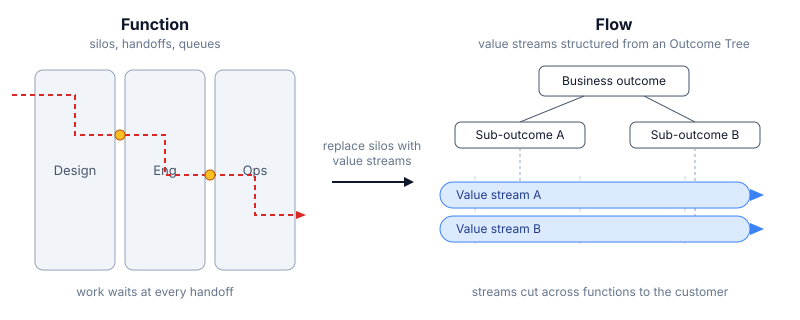

> "Organisations need to shift from function to flow by replacing silos with value streams structured from an Outcome Tree."
>
> Mik Kersten, *Output to Outcome*

## What it means

A classic org groups people by function: design here, engineering there, ops somewhere else. Every piece of work crosses those walls through handoffs, and every handoff is a queue. Each silo optimizes its own output (tickets closed, features shipped, people kept busy) while the customer waits for the whole chain to finish.

The alternative is flow. A value stream is the full path an idea travels to a customer, staffed by one cross-functional team that owns it end to end. No handoffs, no queues between departments.

The Outcome Tree is how you decide which streams to build. Put the business outcome at the top, break it into sub-outcomes, and assign each branch to a stream. Team structure comes from the tree, not from job titles. And since each stream owns a branch of the outcome, you measure it on results (did the outcome move) rather than output (did we ship stuff).

## The shift in one line

From "who does this task?" to "who owns this outcome?".

Related: [[Independence of action]] argues the same idea one level down — structure, not exhortation, is what makes autonomy real.
