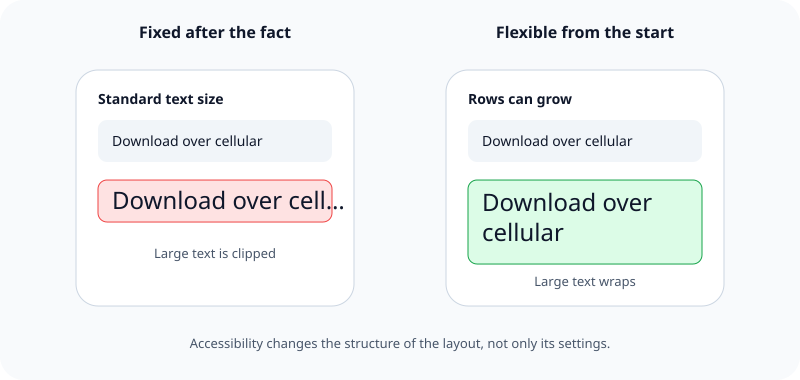

Accessibility is a design constraint from the first sketch, not a check performed after the interface is finished.

## What it means

People may read with larger text, navigate with VoiceOver, need stronger contrast, avoid motion, or interact without precise touch. These needs affect hierarchy, layout, wording, color, control size, and navigation.

Planning for them early leaves room for content to grow and gives every action a clear name and structure. Adding accessibility late often exposes deeper assumptions, such as a layout that works only at one text size or an icon whose meaning exists only in its color.

## Example

A button labeled only with an unusual symbol may look tidy but say nothing useful when VoiceOver reads it. Choosing a clear action and accessibility label is part of designing the button.

Related: [[Standard controls come before custom controls]], [[iOS layouts adapt instead of scaling]], and [[Touch targets need room]].

## Source

- [Apple Human Interface Guidelines: Accessibility](https://developer.apple.com/design/human-interface-guidelines/accessibility)
- [Apple Human Interface Guidelines: Inclusion](https://developer.apple.com/design/human-interface-guidelines/inclusion)
