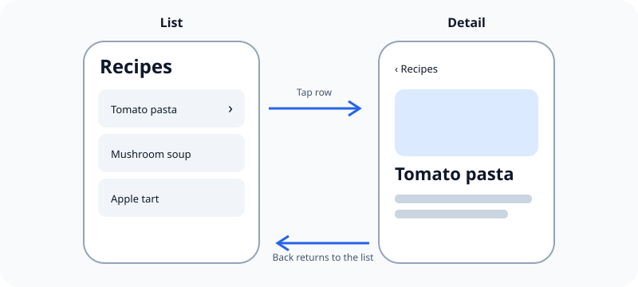

People can use an app sooner when its interactions behave like the rest of iOS.

## What it means

iOS users already know that tapping activates a control, swiping can reveal actions, a back button returns to the previous screen, and a tab changes the current section. Reusing these conventions lets prior experience do part of the teaching.

A surprising interaction is not automatically better because it is original. It adds something people must discover, remember, and recover from when it goes wrong.

## Example

A standard back button communicates more than a custom logo that performs the same action. The logo may look distinctive, but people have to guess what it does.

Related: [[Standard controls come before custom controls]].

## Source

- [Apple Human Interface Guidelines: Designing for iOS](https://developer.apple.com/design/human-interface-guidelines/designing-for-ios)
- [Apple Human Interface Guidelines: Inputs](https://developer.apple.com/design/human-interface-guidelines/inputs)
