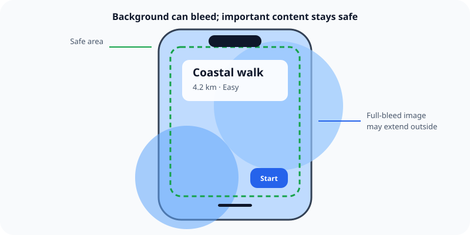

The safe area identifies the part of a screen where system UI and device shape will not cover important content.

## What it means

iPhone screens can include rounded corners, a sensor area, a status area, navigation bars, tab bars, and the Home indicator. Their positions and sizes are not fixed across every device or situation.

Keep essential text and controls inside the safe area. Backgrounds, images, and other decorative content can extend beyond it when cropping or covering does not hide information.

## Example

A photo may fill the whole screen, but its caption and close button should respect the safe area. Otherwise, the caption can collide with the Home indicator or the button can sit beneath system content.

Related: [[iOS layouts adapt instead of scaling]].

## Source

- [Apple Human Interface Guidelines: Layout](https://developer.apple.com/design/human-interface-guidelines/layout)
