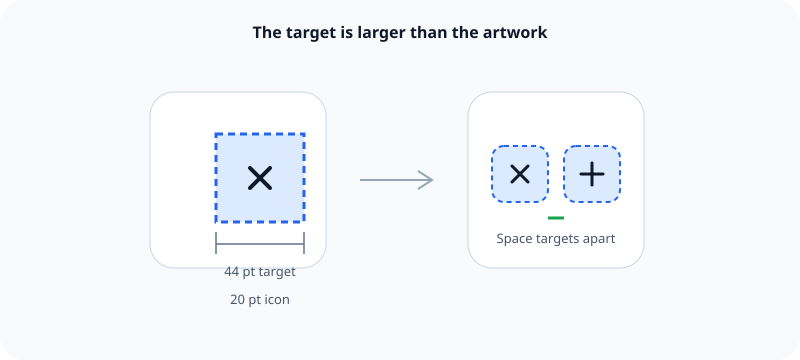

An interactive element needs a large enough target to acquire accurately, even when its visible symbol is small.

## What it means

Apple recommends a minimum target of 44 by 44 points for iOS and iPadOS. The artwork does not need to fill that area. A small icon can have padding that expands the region that responds to touch.

Spacing matters too. Two adequate targets placed too close together still cause accidental taps. Larger targets help people who have limited dexterity, use the device while moving, or simply tap imprecisely.

## Example

A 20-point close symbol can sit inside a 44-point button. Making only the drawn lines tappable would turn a clear icon into a frustrating control.

Related: [[iOS dimensions use points]] and [[Accessibility starts during design]].

## Source

- [Apple Human Interface Guidelines: Accessibility](https://developer.apple.com/design/human-interface-guidelines/accessibility)
- [Apple Human Interface Guidelines: Inputs](https://developer.apple.com/design/human-interface-guidelines/inputs)
