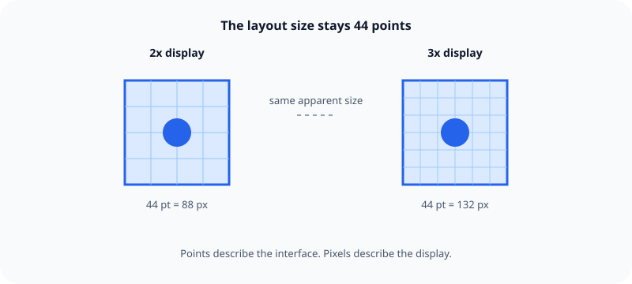

iOS interface dimensions are described in points, not physical screen pixels.

## What it means

A point is a logical unit used to size and position interface elements. The system maps each point to pixels according to the display's scale. This lets the same point-based layout keep a similar apparent size on screens with different pixel densities.

Design measurements such as margins, spacing, and touch targets should therefore use points. Pixel dimensions still matter when preparing raster images, because an image needs enough pixels for the scale at which iOS displays it.

## Example

A 44-point touch target remains 44 points in the layout. Its rendered pixel dimensions can differ between displays without changing the intended interaction size.

Related: [[Touch targets need room]] and [[iOS layouts adapt instead of scaling]].

## Source

- [Apple Human Interface Guidelines: Layout](https://developer.apple.com/design/human-interface-guidelines/layout)
- [Apple Design Resources](https://developer.apple.com/design/resources/)
