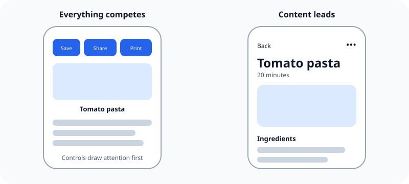

An iOS screen should make its main content or task obvious before it asks people to notice secondary controls.

## What it means

Visual hierarchy is the order in which the interface attracts attention. Size, position, spacing, color, and contrast all affect that order. The most important content or action should be easiest to find. Supporting actions can remain available without competing for attention.

This is why many iOS apps give most of the screen to content and place navigation or actions around its edges.

## Example

On a recipe screen, the recipe name, image, ingredients, and current step are primary. Sharing, printing, and changing settings are useful, but they should not be as prominent as the recipe itself.

Related: [[Familiar interactions reduce learning]] and [[iOS layouts adapt instead of scaling]].

## Source

- [Apple Human Interface Guidelines: Designing for iOS](https://developer.apple.com/design/human-interface-guidelines/designing-for-ios)
- [Apple Human Interface Guidelines: Layout](https://developer.apple.com/design/human-interface-guidelines/layout)
