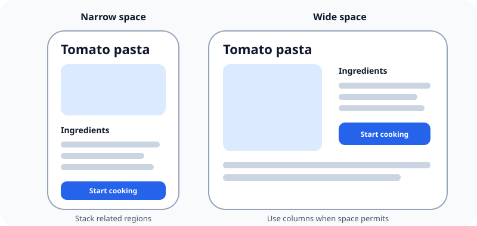

An iOS layout should rearrange itself for available space instead of treating one screen as a picture to enlarge or shrink.

## What it means

Available space changes with the device, orientation, multitasking, system UI, language, and preferred text size. A fixed composition that fits one screenshot can clip, overlap, or become unreadable in another environment.

Adaptive design preserves hierarchy and relationships while allowing content to wrap, controls to move, columns to appear or disappear, and scrolling to handle overflow.

## Example

Two controls that fit side by side may need to stack when their labels grow. Shrinking the labels keeps the original picture but harms readability. Rearranging the controls preserves their purpose.

Related: [[iOS dimensions use points]], [[Safe areas protect important content]], and [[Accessibility starts during design]].

## Source

- [Apple Human Interface Guidelines: Layout](https://developer.apple.com/design/human-interface-guidelines/layout)
