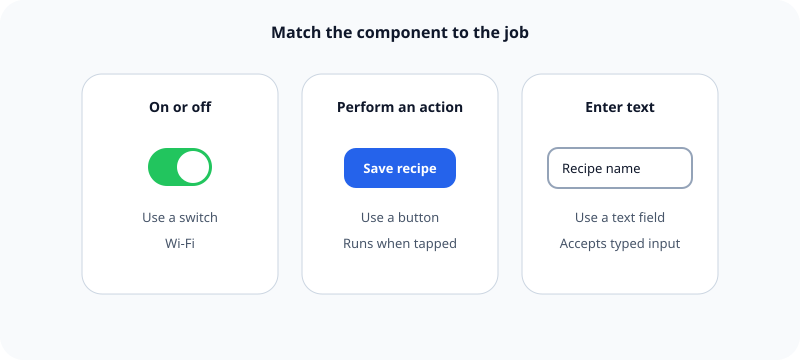

Start with an iOS system component when it already matches the job.

## What it means

Buttons, toggles, text fields, lists, tabs, sheets, and other system components carry familiar appearance and behavior. They also handle interaction states, accessibility information, larger text, and platform changes that a custom control must implement itself.

Custom controls make sense when the interaction truly has no suitable system equivalent. Visual novelty alone is a weak reason because it trades learned behavior for decoration.

## Example

Use a switch for a setting that is either on or off. A custom sliding shape may look unique, but it must recreate the switch's states, touch behavior, keyboard behavior, and accessibility support.

Related: [[Familiar interactions reduce learning]] and [[Accessibility starts during design]].

## Source

- [Apple Human Interface Guidelines: Components](https://developer.apple.com/design/human-interface-guidelines/components)
- [Apple Human Interface Guidelines: Buttons](https://developer.apple.com/design/human-interface-guidelines/buttons)
